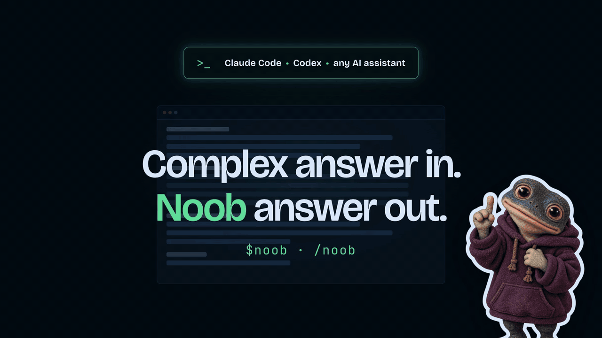

<p align="center">
  
</p>

# Noob Command

> **Turn the last AI answer into something immediately understandable.**

A portable, one-shot command for Claude Code, Codex, other AI coding assistants, and regular AI chats.

Use it when an answer is too long, too technical, or simply more detailed than you need.

## How to use

Invoke Noob Command immediately after the answer you want simplified:

```txt
/noob   # Claude Code
$noob   # Codex
```

| Where | Trigger |
| --- | --- |
| Claude Code | `/noob` |
| Codex | `$noob` |
| Other coding assistants | the form created at install time |
| Regular AI chat | paste the chat version once, then send `noob` |

Each invocation simplifies one answer. It does not activate a persistent mode.

## What it does

Noob Command rereads the assistant's latest answer and re-explains it in a simpler, easier-to-understand, and more concise way. It:

- gives the bottom line first;
- uses everyday language and removes unnecessary technical detail;
- keeps the response to one short paragraph and, when useful, up to three bullets;
- explains what the answer means for you and what you need to do next;
- preserves important warnings, blockers, and decisions.

It uses only the current conversation. It does not inspect files, call tools, perform new research, or change anything.

## Limitations

- Noob Command can only simplify conversation content still available to the assistant.
- It does not verify the previous answer or add new analysis.
- The no-action boundary is instruction-based. The command stays in the main conversation because an isolated read-only subagent would not have access to the answer it needs to simplify.

## Install in Claude Code

Claude Code uses [`.claude/skills/noob`](.claude/skills/noob) and invokes it as `/noob`.

### Assisted installation (recommended)

Paste [install-noob-for-claude-code.md](prompts-for-installation/install-noob-for-claude-code.md) into Claude Code. It checks the current documentation and your local setup before choosing a destination.

### Manual installation

Clone this repository, enter it, then link the skill into your personal skills folder:

```sh
mkdir -p "$HOME/.claude/skills"
ln -s "$PWD/.claude/skills/noob" "$HOME/.claude/skills/noob"
```

For a project-only install, copy `.claude/skills/noob` into that project's `.claude/skills/` folder. Check the current [Claude Code skills documentation](https://code.claude.com/docs/en/skills) if these paths change.

## Install in Codex

The Codex skill is in [`.agents/skills/noob`](.agents/skills/noob) and is invoked as `$noob`.

### Assisted installation (recommended)

Paste [install-noob-for-codex.md](prompts-for-installation/install-noob-for-codex.md) into Codex. It checks the current documentation and your local setup before choosing a destination.

### Manual installation

Clone this repository, enter it, then link the skill into your personal skills folder:

```sh
mkdir -p "$HOME/.agents/skills"
ln -s "$PWD/.agents/skills/noob" "$HOME/.agents/skills/noob"
```

For a project-only install, copy `.agents/skills/noob` into that project's `.agents/skills/` folder. Check the current [Codex skills documentation](https://learn.chatgpt.com/docs/build-skills) if these paths change.

Codex uses `$noob`, not a custom root slash command.

## Other AI assistants and regular chats

- For another coding assistant, paste [install-noob-for-any-ai.md](prompts-for-installation/install-noob-for-any-ai.md).
- For ChatGPT, Claude, Gemini, or another regular chat, paste [noob-ai-chat-version.md](prompts-for-ai-chat/noob-ai-chat-version.md) once, then send exactly `noob` after an answer.

## Repository structure

```txt
noob-command/
├── README.md
├── LICENSE
├── .gitignore
├── .agents/skills/noob/
│   ├── SKILL.md
│   └── agents/openai.yaml
├── .claude/skills/noob/SKILL.md
├── prompts-for-installation/
│   ├── install-noob-for-claude-code.md
│   ├── install-noob-for-codex.md
│   └── install-noob-for-any-ai.md
├── prompts-for-ai-chat/
│   └── noob-ai-chat-version.md
└── public/
    ├── noob-command.gif
    ├── noob-command.mp4
    └── noob-command.png
```

## More AI workflow commands

Small, portable commands for Claude Code, Codex, and any AI assistant.

| Command | What it does |
| --- | --- |
| [WaitGo](https://github.com/arthurglaizal/wait-go) | Batches your instructions, then executes only when you say go. |
| [Session Recap](https://github.com/arthurglaizal/session-recap) | Recaps what you did in the current session and what to pick up next. |
| [Ask Mode](https://github.com/arthurglaizal/ask-mode) | Lets you question your codebase without the assistant changing anything. |
| [AI Handoff](https://github.com/arthurglaizal/ai-handoff) | Packages the current context so another AI can continue the work. |

## Support

If you find my work useful, you can [buy me a coffee](https://ko-fi.com/arturo_ux) ☕️

## License

MIT — see [LICENSE](LICENSE).
